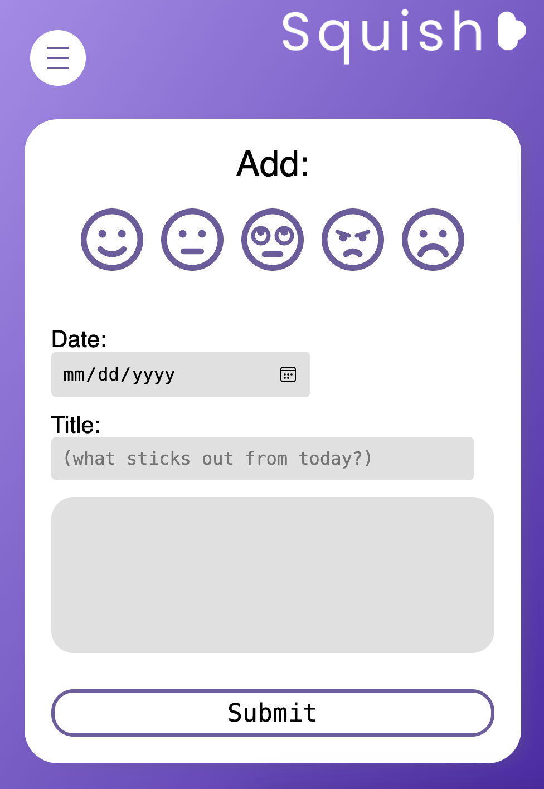

# Squish Mental Journal

This app is a journal for the ones with the busiest hectic lives. It was made as a tool to decompress and spill your thoughts into a journal daily. It includes login/sign up and stores your entries in a database.

**Link to project: [Squish](https://squish-production.up.railway.app/)**

## How It's Made:

**Tech used:** HTML, CSS, JavaScript, Node.js, EJS, Express, Passport, MongoDB

I really wanted to build a journal as a place for people to unwind and let go of things that have been stressing them. So with that in mind I wanted to make sure anyone in my audience would be able to see and use the app. The first thing I did was try to choose a color pallete for the branding of the app. As a designer, I am very particular about UX/UI. Any app I build has to be beautiful and easy to experience by anyone. So the main point of my research into color and branding was accessibility. I decided to research what colors are are affected by color blindness and what colors stay true no matter the condition. I saw that most people who experience color blindness are able to still recognize shades of blue/purple so I went with that and started designing the UI in Figma. Once I had my layouts done I started to code them in HTML & CSS with plans to convert the HTML to EJS. The next thing was to set up my MVC environment for the backend. I set up my models, views, controllers, and routes folders to be able to set up the connections in an organized fashion. Using Node.js & Express I was able to route all my end points as well as inplement user authentication through Passport. I also was able to send GET & POST requests to the Mongo database I created.

## Optimizations

This is the first time I've used Figma as a tool for building an app and it made a huge difference in the outcome. Being able to see, visualize and use the UI before even setting up the code, made it very easy to see what would work well and what may not be as goood of an idea as it was in my mind. Also able to set what UI aspects may or may not be functional to use.

## Lessons Learned:

This project really put me through the ringer as this is my biggest one thus far. Implementing user authentication, and setting up routes to and from as many as 5 different pages and creating a path to make requests to and from the database has taught me a lot. I have become a lot more familiar with the MVC architecture and allowing users to create private databases of their information.

## Upcoming Featurs:

- Global site music player
- Dark Mode
- Notes sorting by date and emotion
- Pagination
- User settings
- Edit and Delete notes
