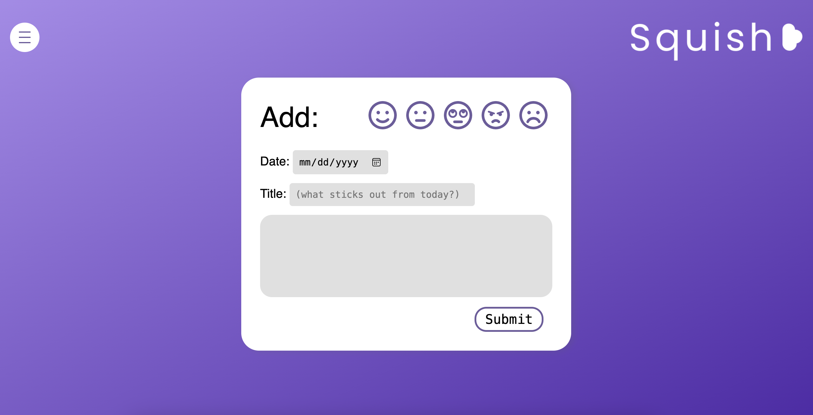

# 🧠 Squish Mental Journal

**Squish Journal** is a journal for the ones with the busiest, most hectic lives. It was made as a tool to decompress and spill your thoughts into a journal daily. It includes login/sign up and stores your entries in a secure database.

🔗 **Live App**: [Squish](https://squish-production.up.railway.app/)

 

---

## 🛠️ How It's Made

## 🛠️ Technologies Used

### Frontend
- HTML
- CSS
- JavaScript
- EJS (Embedded JavaScript Templates) – for server-side rendering

### Backend
- Node.js – JavaScript runtime environment
- Express.js – Web framework for Node.js
- MongoDB – NoSQL database for storing journal entries and user data
- Mongoose – ODM (Object Data Modeling) library for MongoDB and Node.js

### Authentication
- Passport.js – Middleware for user authentication
- bcrypt – Library for hashing passwords

### Deployment
- Railway – Cloud deployment platform

---

I really wanted to build a journal as a place for people to unwind and let go of things that have been stressing them. So with that in mind, I made sure the app would be accessible and simple enough for anyone to use. As a designer, I’m very particular about UX/UI—any app I build has to be beautiful and intuitive.

The first step was choosing a color palette. I did a deep dive into accessibility, especially for users who are color blind. I found that shades of blue and purple tend to be reliably perceived across various forms of color blindness, so I leaned into those and built the UI in Figma first.

Once I had my designs locked in, I coded the layouts in HTML & CSS and converted them into EJS for templating. I structured the backend with an MVC pattern—organizing models, views, controllers, and routes. Using Node.js and Express, I built out all my endpoints, implemented authentication with Passport, and connected everything to a MongoDB database using Mongoose.

---

## ✨ Features

- User Authentication (Register/Login)
- Secure session handling
- Daily Journal Entries (Create, Read, Delete)
- Beautiful, responsive design optimized for accessibility
- Built with an MVC architecture for scalability
- Production deployment using Railway

---

## 📁 Project Structure

```
squish-journal/
├── config/             # Configuration files (e.g., database, passport)
├── controllers/        # Route handler functions
├── images/             # Static image assets
├── middleware/         # Custom middleware functions
├── models/             # Mongoose models (User, Entry)
├── public/             # Public assets (CSS, client-side JS)
├── routes/             # Express route definitions
├── utils/              # Utility functions
├── views/              # EJS templates for rendering pages
├── server.js           # Entry point of the application
├── package.json        # Project metadata and dependencies
└── README.md           # Project documentation
```

---

## 🚀 Getting Started

### Prerequisites
- Node.js (v14 or higher)
- MongoDB (local or Atlas)

### Installation

1. **Clone the repository**
   ```bash
   git clone https://github.com/artslimedev/squish-journal.git
   cd squish-journal
   ```

2. **Install dependencies**
   ```bash
   npm install
   ```

3. **Set up environment variables**

   Create a `.env` file in the root directory and add:
   ```env
   PORT=3000
   MONGODB_URI=your_mongodb_connection_string
   SESSION_SECRET=your_session_secret
   ```

4. **Start the development server**
   ```bash
   npm start
   ```

   Open your browser and go to: `http://localhost:3000`

---

## 🔧 Optimizations

This was my first time using Figma to design a full app before writing any code—and it made a huge difference. Being able to interact with the UI beforehand helped me identify what would actually work and what needed rethinking. I also explored which design elements were practical to implement and which weren't, saving time in development.

---

## 📚 Lessons Learned

This is the most ambitious project I’ve built so far. I learned a lot about implementing authentication, setting up multiple routes, and managing connections to and from a database. It really solidified my understanding of the MVC architecture and gave me hands-on experience building a system where users can create private entries securely.

---

## 📄 License

This project is licensed under the MIT License.
